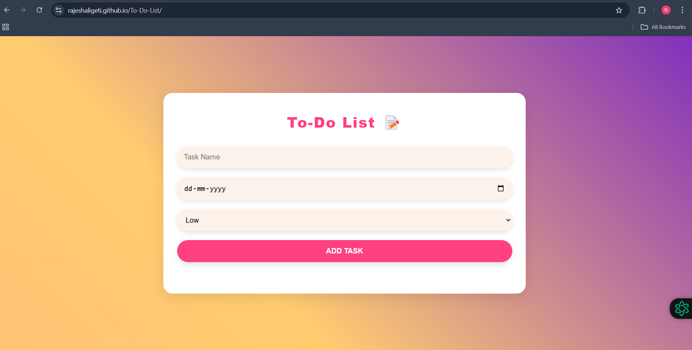

# To-Do List Application

Welcome to the **To-Do List Application**! This is a joyful, feature-rich, and user-friendly to-do list app designed to make task management fun and engaging. With a lively design, playful animations, and an intuitive interface, this app turns organizing your day into a delightful experience. 

### Live Demo
Access the live version [Website](https://rajeshaligeti.github.io/To-Do-List).

## 🖼️ Preview



## ✨ Features

- **Interactive Task Management**: Add, edit, complete, and delete tasks with ease.
- **Rainbow-Themed UI**: A colorful, gradient background with vibrant elements.
- **Priority Tags**: Assign tasks a priority level (Low, Medium, High) with distinct color coding.
- **Responsive Design**: Fully responsive for mobile, tablet, and desktop users.
- **Playful Animations**: Smooth transitions, hover effects, and engaging feedback.
- **Custom Date Picker**: Styled date selector to match the app's lively theme.

## 🚀 Technologies Used

- **HTML5**: For structuring the application.
- **CSS3**: For the vibrant, animated, and responsive design.
- **JavaScript**: For task interactions and dynamic functionalities.

## 🛠️ Installation and Usage

### Clone the Repository
```bash
git clone https://github.com/yourusername/vibrant-todo-list.git
```

### Open the Project
1. Navigate to the project directory:
   ```bash
   cd vibrant-todo-list
   ```
2. Open `index.html` in your browser to start using the app.


## 📂 Project Structure

```
├── index.html      
├── style.css     
├── main.js       
├── screenshot.png    
└── README.md    
```

## 🖌️ Design Highlights

- **Playful Buttons**: Vibrant, rounded buttons that respond with hover effects and scaling animations.
- **Rainbow Gradient**: A smooth, animated gradient background to create a cheerful atmosphere.
- **Priority Badges**: Eye-catching labels for task priorities with dynamic hover effects.
- **Animated Task List**: Tasks slide in and out with smooth transitions for a delightful user experience.


## 📜 License

This project is open source and available under the [MIT License](LICENSE).

---

### 🎉 Let's Make Task Management Fun! 🎉

If you enjoy using this app, don't forget to ⭐ the repository and share it with your friends. Happy organizing! 😊
